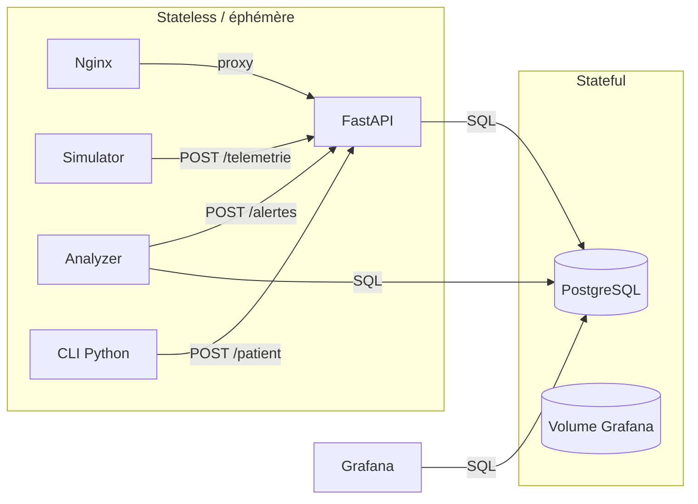

# MediComTel Projet e-Health (mini-prototype Docker)

**Contexte pédagogique** — Ce dépôt correspond au **mini-prototype** du système **MediComTel** : gestion de dossiers patients et **télémétrie** (rythme cardiaque, SpO₂, température) avec **alertes en temps quasi réel** et **tableau de bord** pour le suivi.  

---

## 1. Rappel des objectifs du système 

Un organisme de soins souhaite **surveiller à distance** des patients (ex. pilotes, athlètes) lors d’événements. Le système doit :

- traiter des **données de santé sensibles** ;
- ingérer de la **télémétrie** et produire des **alertes** exploitables rapidement ;
- offrir aux **médecins** une **vue consolidée** : historique des mesures et alertes récentes.

Le prototype ci-dessous **implémente une partie** de ce périmètre : dossiers patients simplifiés, flux de télémétrie simulé, règles d’alerte automatiques, visualisation dans un dashboard open source.

---

## 2. Besoins métier

| Besoin métier | Ce que le prototype illustre |
|---------------|------------------------------|
| Suivi à distance pendant un effort / une compétition | Service **simulateur** qui pousse des signes vitaux fictifs vers l’API |
| Réaction rapide face à un dépassement de seuils | Service **analyzer** + enregistrement des alertes en base |
| Vue opérationnelle pour le soignant | **Grafana** : courbes HR / température / SpO₂, table des alertes, liste des patients « actifs » |
| Gestion minimale des dossiers | API + **CLI** pour créer un patient (équivalent d’une saisie administrative légère) |

**Non couvert** par ce prototype : authentification forte, chiffrement au repos, hébergement certifié HDS, intégration HL7/FHIR, gestion des RDV, applications mobiles patients, etc.

---

## 3. Besoins techniques

| Besoin technique | Réalisation dans le dépôt |
|------------------|---------------------------|
| Persistance des données médicales / télémétrie | **PostgreSQL 14**, schéma `db/init/schema.sql` (tables `patients`, `telemetrie`, `alertes`) |
| API métier exposée sur le réseau Docker | **FastAPI** (`API/`), endpoints REST documentés implicitement par le code |
| Chaîne « mesure → analyse → alerte » | **simulator** → API ; **analyzer** lit la DB et appelle `POST /alertes` |
| Tableau de bord | **Grafana** (provisionning dans `grafana/provisioning/`) |
| Point d’entrée HTTP unique côté hôte (optionnel) | **Nginx** reverse proxy vers les réplicas de l’API (profil `lb`) |
| Orchestration reproductible | **`docker-compose.yaml`** (infrastructure as code au sens Compose) |

**Données traitées** : identité légère (nom, prénom, date de naissance), statut de dossier, type de patient pour la démo, séries temporelles de signes vitaux, alertes typées avec gravité.

---

## 4. Architecture du prototype

### 4.1 Schéma logique (flux et services)



- **Stateful** : PostgreSQL (vérité des dossiers, mesures, alertes) ; volume Grafana pour préférences / cache interne.  
- **Stateless** : conteneurs API, Nginx, workers (simulator, analyzer), CLI — remplaçables et scalables horizontalement pour l’API derrière Nginx.

### 4.2 Services Docker Compose (profils)

| Service | Profil | Rôle |
|---------|--------|------|
| `db` | `core` | Base de données |
| `api` | `core` | Backend REST |
| `nginx` | `lb` | Load balancer HTTP → plusieurs instances `api` |
| `grafana` | `viz` | Dashboard « médecin » |
| `simulator` | `workers` | Génération de télémétrie fictive |
| `analyzer` | `workers` | Détection tachycardie / bradycardie / hypoxémie (SpO₂) |
| `cli` | `cli` | Client texte pour créer des patients |

**Contrainte cours (≥ 3 services)** : ce dépôt en compte **plus de trois** (DB + API + Grafana + workers + proxy + CLI).

**Rôle « frontend »** : le sujet demande un lien entre interface et backend. Ici, le **tableau de bord médecin** est **Grafana** (connexion à PostgreSQL, pas appels REST directs à FastAPI). Les **écritures** (patient, télémétrie) passent par l’**API** (CLI, simulateur, analyzer). À expliquer dans la PDF pour éviter toute ambiguïté avec un « SPA classique ».

---

## 5. Analyse des risques 

| Risque | Illustration dans ce labo | Piste de mitigation (cible production) |
|--------|---------------------------|----------------------------------------|
| Fuite de données de santé | Mots de passe par défaut, pas de chiffrement des volumes | Secrets managés, TLS, chiffrement au repos, hébergement conforme |
| Accès non autorisé à l’API / à Grafana | Pas d’auth sur les endpoints métier | OAuth2 / JWT, SSO, RBAC Grafana |
| Indisponibilité | Un seul nœud, pas de HA Postgres | Réplication, backups, healthchecks (déjà présents en rudimentaire) |
| Intégrité / repudiation | Alertes injectables via API sans traçabilité forte | Journalisation, signatures, contrôle d’accès par rôle |
| Faux positifs / négatifs cliniques | Seuils naïfs dans `analyzer/` | Validation médicale, file d’escalade, ML hors scope ici |

Ce prototype est **volontairement minimal** sur la sécurité : il sert à démontrer l’**architecture cloud-native** et les **flux de données**, pas un déploiement clinique.

---

## 6. Principes cloud-native mis en avant 

- **Microservices logiques** : API, persistance, analyse batch légère, visualisation, génération de charge découplées.  
- **Infrastructure as code** : tout est décrit dans `docker-compose.yaml` + fichiers de provisioning Grafana.  
- **Passage à l’échelle manuel** : plusieurs réplicas de `api` derrière Nginx (voir section 9).  
- **Observabilité rudimentaire** : healthcheck API, logs conteneurs, dashboards Grafana.

---

## 7. Prérequis et configuration

- **Docker** et **Docker Compose v2** installés.  
- Optionnel : copier les variables d’environnement.

```bash
cp .env.example .env
```

---

## 8. Démarrage et vérification fonctionnelle

### 8.1 Lancer l’ensemble prévu pour la démo

```bash
docker compose --profile core --profile workers --profile viz --profile lb up -d --build
```

| URL / accès | Usage |
|-------------|--------|
| http://localhost:8081 | API via **Nginx** (`/health`, `/patient`, `/telemetrie`, `/alertes`, `/patients`) |
| http://localhost:8082 | **Grafana** (compte par défaut `admin` / `admin`, surchargeable via `.env`) |

### 8.2 Scénario de test recommandé (alertes en temps quasi réel)

1. Démarrer au minimum le profil `core` :  
   `docker compose --profile core up -d --build`
2. Créer un patient avec statut **`cli`** (sinon le simulateur l’ignore) :  
   `docker compose --profile core --profile cli run --rm --build cli`  
   Choisir le type **unstable** pour déclencher plus facilement des alertes.
3. Lancer les workers :  
   `docker compose --profile workers up -d --build`
4. Ouvrir Grafana : vérifier les courbes et la table des **alertes** ; consulter les logs :  
   `docker compose logs -f analyzer`

### 8.3 Exemples `curl` (hôte, avec Nginx)

```bash
curl -s http://localhost:8081/health

curl -s -X POST http://localhost:8081/patient \
  -H "Content-Type: application/json" \
  -d '{"nom":"Dupont","prenom":"Alice","dob":"1990-04-12","statut":"cli","type_patient":"normal"}'

curl -s -X POST http://localhost:8081/telemetrie \
  -H "Content-Type: application/json" \
  -d '{"patient_id":1,"hr":80,"spo2":98,"temp":37.1}'
```

Depuis un autre conteneur sur le réseau Compose : `http://api:8000`.

### 8.4 Réinitialiser les données

```bash
docker compose --profile core --profile workers --profile viz --profile lb down -v
```

---

## 9. Montée en charge manuelle de l’API (`--scale`)

Nginx est configuré pour résoudre le service `api` (plusieurs tâches derrière le même nom DNS Docker).

```bash
docker compose --profile core --profile lb up -d --build --scale api=3
```

Vérifier que plusieurs tâches répondent (noms de conteneurs différents) :  
`docker compose ps`

**Limite** : la base et Grafana ne sont pas scalés ici ; seul le **tier API** illustre l’élasticité horizontale.

---

## 10. Grafana

- Datasource Postgres : `grafana/provisioning/datasources/postgres.yaml` (hôte `db`, port `5432`).  
- Si vous changez `POSTGRES_USER` / `POSTGRES_PASSWORD` dans `.env`, **alignez** ces valeurs dans ce fichier.  
- Dashboards : `grafana/provisioning/dashboards/` + JSON dans `grafana/dashboards/`.

---

## 11. Script d’enchaînement (Linux / Git Bash / WSL)

```bash
chmod +x test.sh
./test.sh
```


## 12. Limites connues du prototype

- Pas de gestion des **RDV** ni des **urgences** métier au-delà des alertes vitales simulées.  
- **Sécurité** faible : convenable uniquement en local / salle de TP.  
- **Grafana** lit la base directement : pas de modèle « API unique » pour toute l’UI ; choix assumé pour le cours (outil dashboard open source).  
- Données **fictives** ; aucune validation clinique.  
- Haute disponibilité et **CI/CD** non inclus (extensions possibles pour un bonus ou un second rendu).

---

## 13. Fichiers utiles pour la personnalisation

| Fichier / dossier | Rôle |
|-------------------|------|
| `db/init/schema.sql` | Modèle relationnel |
| `API/app/main.py` | Endpoints REST |
| `analyzer/app/main.py` | Règles d’alerte |
| `simulator/app/main.py` | Signal simulé |
| `docker-compose.yaml` | Topologie et variables |
| `nginx.conf` | Répartition de charge vers `api` |


*MediComTel — prototype pédagogique.*
